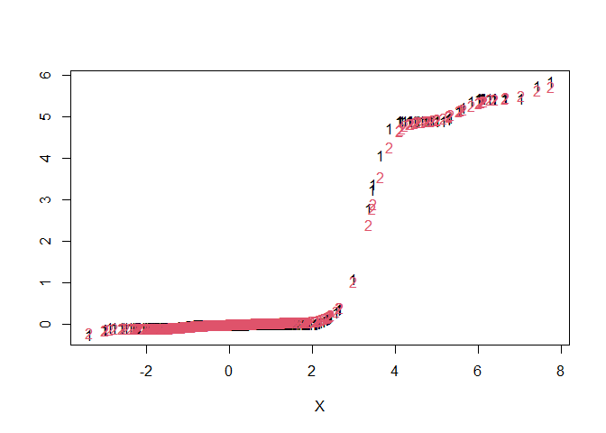

<!-- README.md is generated from README.Rmd. Please edit that file -->

# mleb

<!-- badges: start -->

<!-- badges: end -->

The goal of mleb is to fit the modified likelihood Empirical Bayes
(MLEB) estimator using the kernel Tweedie formula. Parameters can be
explicitly supplied or automatically determined using Stein’s Unbiased
Risk Estimate () or plug-in () methods.

## Installation

You can install the development version of mleb from
[GitHub](https://github.com/) with:

``` r
# install.packages("pak")
pak::pak("wenkuangyu/mleb")
```

## Example

This is a basic example which shows you how to solve a common problem:

``` r
library(mleb)

# generate observations
set.seed(1037)
theta <- rep(c(0, 5), c(950, 50))
X <- theta + rnorm(1000)

fit <- mleb(X, method = 'plugin')

fit2 <- mleb(X, method = 'sure')

matplot(X, cbind(fit$mono_tweedie, fit2$mono_tweedie), ylab = '')
```



``` r

# average squared errors
c(mean((fit$mono_tweedie - theta)^2), mean((fit2$mono_tweedie - theta)^2))
#> [1] 0.03986013 0.04753733
```
